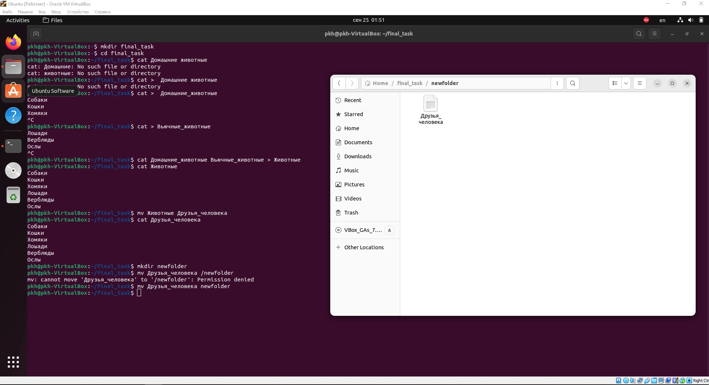

## Итоговое задание

1. _Используя команду cat в терминале операционной системы Linux, создать два файла Домашние животные (заполнив файл собаками, кошками,
хомяками) и Вьючные животными заполнив файл Лошадьми, верблюдами и
ослами, а затем объединить их. Просмотреть содержимое созданного файла.
Переименовать файл, дав ему новое имя (Друзья человека)._
2. _Создать директорию, переместить файл туда._

Результат зафиксирован на скриншоте:

3. _Подключить дополнительный репозиторий MySQL. Установить любой пакет из этого репозитория._
4. _Установить и удалить deb-пакет с помощью dpkg._

Результат задания 3, 4, 5 зафиксирован на скриншоте:

5. _Выложить историю команд в терминале ubuntu_

История сохранена в текстовом документе History_ubuntu.txt:
[Title](History_ubuntu.txt)

6. _Нарисовать диаграмму, в которой есть класс родительский класс, домашние животные и вьючные животные, в составы которых в случае домашних животных войдут классы: собаки, кошки, хомяки, а в класс вьючные животные войдут: Лошади, верблюды и ослы._

Блок-схема подготовлена в drawio:

7. _В подключенном MySQL репозитории создать базу данных “Друзья человека”_
8. _Создать таблицы с иерархией из диаграммы в БД_
9. _Заполнить низкоуровневые таблицы именами(животных), командами которые они выполняют и датами рождения_
10. _Удалив из таблицы верблюдов, т.к. верблюдов решили перевезти в другой питомник на зимовку. Объединить таблицы лошади, и ослы в одну таблицу._
11. _Создать новую таблицу “молодые животные” в которую попадут все животные старше 1 года, но младше 3 лет и в отдельном столбце с точностью до месяца подсчитать возраст животных в новой таблице_
12. _Объединить все таблицы в одну, при этом сохраняя поля, указывающие на прошлую принадлежность к старым таблицам._

Скрипт SQL для заданий 7-12 сохранен в файле (см. папку MySQL):
[Title](MySql/SQL_script_for_tasks_7-12.sql)

13. _Создать класс с Инкапсуляцией методов и наследованием по диаграмме._
14. _Написать программу, имитирующую работу реестра домашних животных._
15. _Создайте класс Счетчик, у которого есть метод add(), увеличивающий̆ значение внутренней̆ переменной̆ на 1 при нажатии “Завести новое животное” Сделайте так, чтобы с объектом такого типа можно было работать в блоке try-with-resources. Нужно бросить исключение, если работа с объектом типа счетчик была не в ресурсном try и/или ресурс остался открыт. Значение считать в ресурсе try, если при заведения животного заполнены все поля._

Программа Java для заданий 13-15 имеет название Final_task_v5. 
В программе: 
- выполнены классы животных из предыдущих заданий (см. пакет Animals);
- выполнены классы для создания записи нового животного в реестре, класс с методами получения информации о животном по id, получении информации о командах, которые знает животное, тренировки новых команд, изменении записи в реестре и удалении записей (см. пакет Controller). Здесь также выполнен счетчик для задания 15
- созданы классы оформления консоли взаимодействия с пользовтелем (см. пакет Console). 
- Класс для установки соединения с БД, выполнения команд с sql-запросами выполнены (см. пакет Services)
- Данные о подключении выполнены в отдельном файле database.properties в пакете resources

В программе не выполнено создание новых пустых таблиц SQL для дальнейшего заполнения. Соответственно, для проверки работы программы был создан отдельный скрипт SQL, создающий стартовые таблицы реестра животных, с которыми программа работает без ошибок и выполняет необходимые по заданию действия. Скрипт приведен ниже (см. папку MySQL):
[Title](MySql/SQL_script_for_task_13-15.sql)